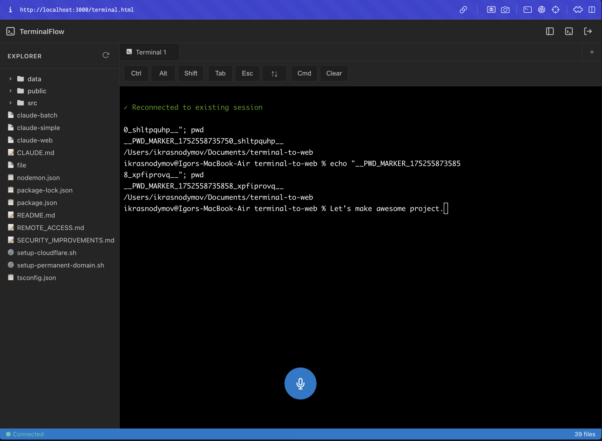
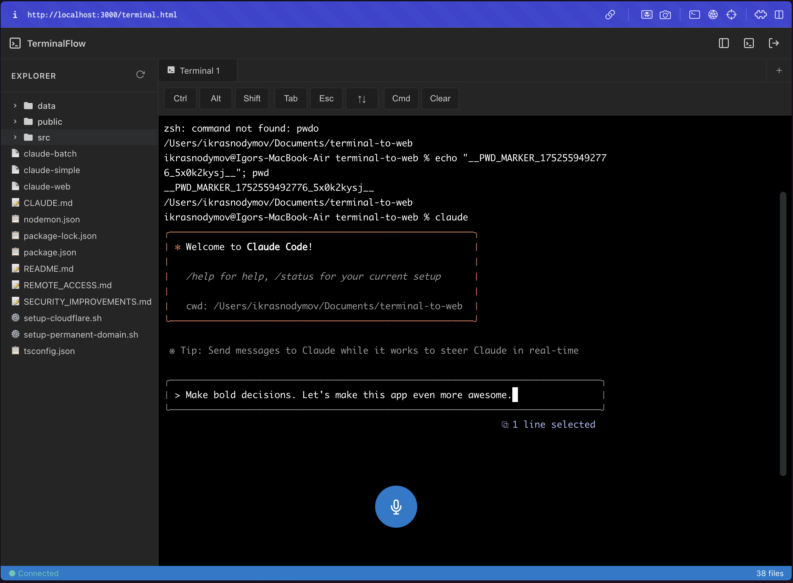

# TerminalFlow 🖥️

A modern web-based terminal emulator that enables secure remote control of your macOS terminal from any device through a web browser. Features email-based two-factor authentication, mobile optimization, and speech-to-text integration.

   

## 📸 Screenshots

### IDE Interface with File Explorer

*Full IDE experience with file explorer, terminal interface, and virtual mobile controls*

### Claude Code Integration

*Integrated AI assistance with speech-to-text capabilities powered by Groq API*

## ✨ Features

- 🖥️ **Full Terminal in Browser** - Access zsh/bash from any device
- 📱 **Mobile Optimized** - Virtual keyboard and touch-friendly controls
- 🔐 **Secure Authentication** - Email-based one-time access codes
- ⚡ **Real-time Communication** - WebSocket for instant terminal response
- 🌍 **Remote Access** - Cloudflare Tunnel for worldwide accessibility
- 🗣️ **Speech-to-Text** - Voice commands powered by Groq API
- 📋 **Quick Commands** - Persistent command templates for efficiency
- 🔄 **Auto-scaling** - Adapts to screen size and orientation
- 🛡️ **Security Features** - Rate limiting, JWT tokens, and XSS protection
- 📁 **File Explorer** - Browse and manage files with real-time directory sync

## 🚀 Quick Start

### 1. Prerequisites

- Node.js 18+ 
- macOS (for PTY terminal support)
- npm or yarn package manager

### 2. Installation

```bash
# Clone the repository
git clone https://github.com/your-username/terminal-to-web.git
cd terminal-to-web

# Install dependencies
npm install
```

### 3. Environment Configuration

```bash
# Copy the example environment file
cp .env.example .env

# Edit the configuration
nano .env
```

#### Required Environment Variables

```bash
# Security (MUST CHANGE FOR PRODUCTION!)
JWT_SECRET=your-secret-key-minimum-32-characters
ACCESS_PASSWORD=legacy-password-for-compatibility

# Email Service (Resend API - 3000 emails/month free)
RESEND_API_KEY=re_your_resend_api_key
NOTIFICATION_EMAIL=your-email@domain.com

# Optional: Speech-to-Text (Groq API)
GROQ_API_KEY=gsk_your_groq_api_key

# Server Configuration
PORT=3000
NODE_ENV=development
MAX_LOGIN_ATTEMPTS=5
LOCKOUT_TIME_MINUTES=15
ACCESS_CODE_EXPIRY_MINUTES=10
```

### 4. Run the Application

```bash
# Development (local only)
npm run dev

# Development with remote access
npm run start:dev

# Production
npm run build
npm start
```

## 🔑 API Setup Instructions

### Resend Email Service (Required)

1. **Create Account**: Visit [resend.com](https://resend.com/)
2. **Get API Key**: 
   - Sign up for free account (3000 emails/month)
   - Navigate to API Keys section
   - Create new API key
   - Copy the key starting with `re_`

3. **Configure**:
   ```bash
   RESEND_API_KEY=re_your_api_key_here
   NOTIFICATION_EMAIL=your-email@domain.com
   ```

### Groq Speech-to-Text (Optional)

1. **Create Account**: Visit [console.groq.com](https://console.groq.com/)
2. **Get API Key**:
   - Sign up for free account
   - Navigate to API Keys
   - Create new API key
   - Copy the key starting with `gsk_`

3. **Configure**:
   ```bash
   GROQ_API_KEY=gsk_your_groq_api_key_here
   ```

### Cloudflare Tunnel (For Remote Access)

1. **Install cloudflared**:
   ```bash
   # macOS
   brew install cloudflared
   
   # Or download from: https://github.com/cloudflare/cloudflared/releases
   ```

2. **Quick Setup** (Development):
   ```bash
   npm run start:dev
   ```
   This will show a public URL like: `https://random-name.trycloudflare.com`

3. **Named Tunnel** (Production):
   ```bash
   cloudflared tunnel login
   cloudflared tunnel create terminal-web
   cloudflared tunnel route dns terminal-web terminal.yourdomain.com
   ```

## 🏗️ Architecture

### Backend Stack
- **Node.js + TypeScript** - Server runtime and type safety
- **Express.js** - Web server framework
- **Socket.IO** - Real-time WebSocket communication
- **node-pty** - PTY process management for terminal emulation
- **JWT** - Secure authentication tokens
- **Resend/Nodemailer** - Email service for 2FA codes

### Frontend Stack
- **Vanilla JavaScript** - Lightweight client-side code
- **xterm.js** - Terminal emulation in browser
- **Socket.IO Client** - Real-time communication
- **Responsive CSS** - Mobile-optimized interface

### Project Structure

```
src/
├── server.ts              # Main Express server + Socket.IO
├── config.ts              # Configuration with validation
├── terminalHandler.ts     # Terminal event handling
├── services/              # Business logic layer
│   ├── TerminalManager.ts # PTY process management
│   ├── AccessCodeService.ts # 2FA code generation/validation
│   ├── CommandService.ts  # Persistent command storage
│   ├── ResendEmailService.ts # Email service (primary)
│   ├── EmailService.ts    # Gmail SMTP fallback
│   └── SpeechService.ts   # Speech-to-text integration
├── middleware/            # Express/Socket.IO middleware
│   ├── auth.ts           # JWT authentication
│   └── errorHandler.ts   # Error handling
└── utils/                # Utility functions
    ├── security.ts       # Rate limiting & security
    ├── validation.ts     # Input validation & XSS protection
    └── logger.ts         # Structured logging

public/
├── index.html           # Authentication interface
├── terminal.html        # IDE interface with file explorer
├── app.js              # Authentication logic
├── ide-app.js          # IDE and terminal functionality
└── style.css           # Responsive styles
```

## 🔐 Security Features

### Built-in Protection
- **Rate Limiting**: 5 authentication attempts per IP per 15 minutes
- **JWT Tokens**: 24-hour expiration with secure signing
- **Access Codes**: 6-digit codes with 10-minute expiry
- **Input Validation**: XSS protection and data sanitization
- **Environment Filtering**: Secure PTY process environment
- **IP Tracking**: Progressive lockout with exponential backoff

### Production Security Recommendations

1. **Change Default Secrets**:
   ```bash
   # Generate random JWT secret
   openssl rand -base64 32
   ```

2. **Configure CORS**:
   ```bash
   CORS_ORIGIN=https://yourdomain.com,https://anotherdomain.com
   ```

3. **Use HTTPS**: Cloudflare Tunnel provides automatic HTTPS
4. **Monitor Logs**: All events are logged in structured format

## 📱 Mobile Optimization

### Supported Devices
- ✅ iPhone/iPad (Safari, Chrome)
- ✅ Android (Chrome, Firefox) 
- ✅ Desktop browsers (all modern browsers)

### Mobile Features
- **Virtual Controls**: Ctrl/Alt/Tab/Esc buttons for mobile users
- **Arrow Keys**: Dedicated navigation panel
- **Quick Commands**: Persistent localStorage-based shortcuts
- **Responsive Design**: Font sizing adapts to device orientation
- **Touch Support**: Integrated virtual keyboard
- **Speech Input**: Voice-to-text command entry

## 🚀 Usage

### Authentication Flow

1. Open the web application (local or public URL)
2. Click "📧 Request Access Code"
3. Enter your email address
4. Check email for 6-digit access code
5. Enter code and click "🔐 Login"
6. Access granted for 24 hours

### Terminal Usage

- **Desktop**: Works like a native terminal
- **Mobile Controls**:
  - `Ctrl/Alt/Tab/Esc`: Virtual modifier keys
  - `↑↓←→`: Arrow key navigation
  - `CMD`: Quick commands panel
  - `[ ]`: Fullscreen toggle
  - `🎤`: Speech-to-text input

### Speech-to-Text

1. Click the microphone button (🎤) in the terminal
2. Speak your command
3. Command is automatically transcribed and entered
4. Supports multiple languages with auto-detection

### Quick Commands

1. Click the `CMD` button
2. Add new command with `+` button
3. Enter command and description
4. Use for rapid command execution

## 🛠️ Development Commands

```bash
# Development
npm run dev              # Server with hot reload
npm run start:dev        # Server + Cloudflare tunnel
npm run start:all        # Build + server + tunnel

# Production
npm run build            # Compile TypeScript
npm start               # Run production build

# Code Quality
npm run lint            # ESLint check
npm run lint:fix        # Auto-fix linting issues
npm run format          # Prettier formatting
npm run typecheck       # TypeScript type checking
```

## 🚀 Deployment

### VPS Deployment

1. **Server Preparation** (Ubuntu/Debian):
   ```bash
   curl -fsSL https://deb.nodesource.com/setup_18.x | sudo -E bash -
   sudo apt-get install -y nodejs
   ```

2. **Application Setup**:
   ```bash
   git clone https://github.com/your-username/terminal-to-web.git
   cd terminal-to-web
   npm install
   npm run build
   ```

3. **Systemd Service**:
   ```ini
   [Unit]
   Description=TerminalFlow
   After=network.target
   
   [Service]
   Type=simple
   User=www-data
   WorkingDirectory=/path/to/terminal-to-web
   ExecStart=/usr/bin/node dist/server.js
   Restart=always
   Environment=NODE_ENV=production
   
   [Install]
   WantedBy=multi-user.target
   ```

### Docker Deployment

```dockerfile
FROM node:18-alpine
WORKDIR /app
COPY package*.json ./
RUN npm ci --only=production
COPY . .
RUN npm run build
EXPOSE 3000
CMD ["npm", "start"]
```

## 🔧 Troubleshooting

### Common Issues

#### 1. node-pty Compilation Errors
```bash
# macOS
xcode-select --install

# Reinstall dependencies
rm -rf node_modules package-lock.json
npm install
```

#### 2. Authentication Problems
- **Code not received**: Check RESEND_API_KEY in .env
- **Invalid code**: Codes expire after 10 minutes
- **Rate limiting**: Wait 15 minutes or restart server

#### 3. Cloudflare Tunnel Issues
```bash
# Check tunnel status
cloudflared tunnel list

# Restart tunnel
pkill cloudflared
npm run start:dev
```

#### 4. WebSocket Connection Failures
- Ensure server is running on correct port
- Check browser console for error messages
- Verify JWT token validity
- Clear browser localStorage if needed

### Development Mode

Without email configuration, access codes are displayed in server console:

```bash
============================================================
🖥️  TERMINAL ACCESS CODE
============================================================
📧 Email: your-email@domain.com
🔐 CODE: 123456
⏰ Valid for: 10 minutes
============================================================
```

## 📊 Monitoring & Health Check

### Health Endpoint
```bash
curl http://localhost:3000/health
```

### Structured Logging
All events are logged in JSON format:
```json
{
  "level": "info",
  "message": "Access code created",
  "email": "user@domain.com",
  "ip": "192.168.1.1",
  "timestamp": "2024-01-01T12:00:00Z"
}
```

## 🤝 Contributing

### Setup Development Environment

1. Fork the repository
2. Create a feature branch: `git checkout -b feature-name`
3. Make your changes
4. Run tests: `npm run lint && npm run typecheck`
5. Commit changes: `git commit -m "feat: description"`
6. Push to branch: `git push origin feature-name`
7. Create Pull Request

### Code Style

- Use TypeScript for all backend code
- Follow ESLint and Prettier configurations
- Write descriptive commit messages
- Add tests for new features
- Update documentation as needed

## 📄 License

ISC License - see [LICENSE](LICENSE) file for details.

## 🆘 Support

### Documentation
- [CLAUDE.md](./CLAUDE.md) - Technical documentation for developers
- [SECURITY_IMPROVEMENTS.md](./SECURITY_IMPROVEMENTS.md) - Security enhancements
- [REMOTE_ACCESS.md](./REMOTE_ACCESS.md) - Remote access configuration

### Bug Reports

When reporting issues, please include:
1. Detailed problem description
2. Server logs (if applicable)
3. Node.js version and operating system
4. Steps to reproduce the issue
5. Expected vs actual behavior

---

**⚡ Quick Start**: `npm install && npm run start:dev` - Your terminal accessible from anywhere in the world!